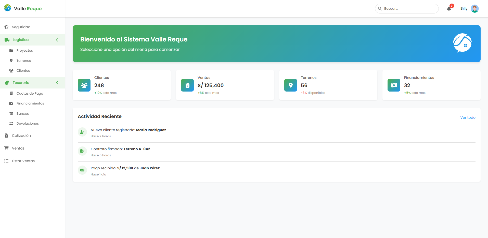

# 🏘️ SIGI-VR — Sistema de Gestión Inmobiliaria Valle Reque

**SIGI-VR** es un sistema integral para la gestión de proyectos inmobiliarios de la Constructora Valle Reque S.A.C. Desarrollado con **Flask** en el backend y **React** en el frontend, este sistema permite administrar usuarios, terrenos, clientes, financiamientos, ventas y más.

## 🚀 Tecnologías Usadas

### Backend (Flask + MySQL)
- Flask (Python)
- MySQL
- SQL Stored Procedures
- Werkzeug (seguridad)
- JWT/Session-based Auth (pendiente/mejorable)
- MVC pattern

### Frontend (React + Vite + TypeScript)
- React 18+
- Vite
- TypeScript
- React Router DOM
- FontAwesome
- CSS personalizado

## 📁 Estructura del Proyecto

```
/backend
  ├── src/
  │   ├── routes/
  │   ├── models/
  │   ├── entities/
  │   ├── database/
  │   └── app.py
  └── requirements.txt

/frontend
  ├── src/
  │   ├── components/
  │   ├── pages/
  │   ├── api/
  │   ├── styles/
  │   └── main.tsx
  └── vite.config.ts
```

## 🔐 Funcionalidades

- ✅ Inicio de sesión con autenticación
- ✅ Acceso por roles (Administrador, Asesor, etc.)
- ✅ Gestión de terrenos y proyectos
- ✅ Módulo de clientes y familiares
- ✅ Financiamientos y cuotas
- ✅ Estado lógico (activo/inactivo/eliminado)
- ✅ Validaciones visuales y lógicas
- ✅ Interfaz responsive y moderna

## 🛠️ Instalación

### 1. Clona el proyecto
```bash
git clone https://github.com/tuusuario/SIGI-VR.git
cd SIGI-VR
```

### 2. Backend

```bash
cd backend
python -m venv venv
source venv/bin/activate  # Windows: venv\Scripts\activate
pip install -r requirements.txt
python run.py
```

Asegúrate de tener una base de datos MySQL corriendo con los procedimientos almacenados necesarios.

### 3. Frontend

```bash
cd frontend
npm install
npm run dev
```

## 📦 Variables de Entorno

Crea un archivo `.env` tanto en `backend/` como en `frontend/` si lo necesitas:

**Ejemplo para backend:**
```
DB_HOST=localhost
DB_USER=root
DB_PASSWORD=
DB_NAME=valle_reque
```

**Ejemplo para frontend (Vite):**
```
VITE_API_URL=http://localhost:5000/api
```

## 📸 Capturas



## 📌 Estado del Proyecto

🔧 En desarrollo — funcionalidades principales completadas, mejoras visuales y de seguridad en curso.

## 👨‍💻 Autor

**Constructora Valle Reque S.A.C**  
Desarrollado por el equipo de sistemas (Equipo Oreo)  
Lambayeque, Perú 🇵🇪